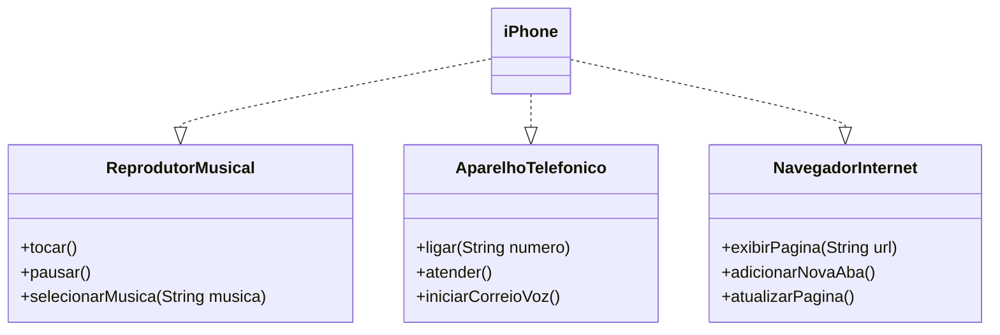

# Projeto iPhone - Implementação de Funcionalidades

### Projeto DIO - Desafio POO

Este projeto implementa, em Java, as funcionalidades principais do iPhone, conforme descrito no vídeo de lançamento de 2007. O projeto envolve a criação de interfaces que representam funcionalidades como **Reprodutor Musical**, **Aparelho Telefônico** e **Navegador na Internet**, bem como uma classe `iPhone` que implementa todas essas interfaces.

## Funcionalidades

1. **Reprodutor Musical**:
   - `tocar()`: Inicia a reprodução de uma música.
   - `pausar()`: Pausa a reprodução da música.
   - `selecionarMusica(String musica)`: Seleciona uma música específica para tocar.

2. **Aparelho Telefônico**:
   - `ligar(String numero)`: Faz uma chamada para o número especificado.
   - `atender()`: Atende uma chamada.
   - `iniciarCorreioVoz()`: Inicia o correio de voz.

3. **Navegador na Internet**:
   - `exibirPagina(String url)`: Exibe a página da web especificada.
   - `adicionarNovaAba()`: Adiciona uma nova aba no navegador.
   - `atualizarPagina()`: Atualiza a página atual.

## Estrutura do Projeto

- **Iphone.java**: Classe que implementa as interfaces `ReprodutorMusical`, `AparelhoTelefonico` e `NavegadorInternet`.
- **ReprodutorMusical.java**: Interface que define os métodos do reprodutor musical.
- **AparelhoTelefonico.java**: Interface que define os métodos do aparelho telefônico.
- **NavegadorInternet.java**: Interface que define os métodos do navegador na internet.

### Diagrama UML

O projeto foi modelado com base no seguinte diagrama UML, que representa as relações entre a classe `iPhone` e as interfaces:

**Autor:** *@matheusmgs22*
